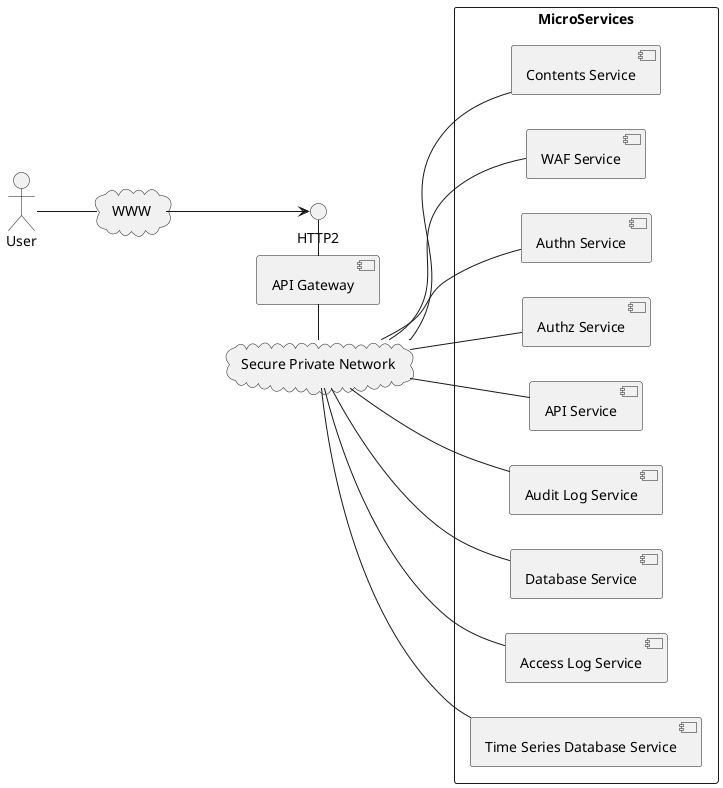

# API　Gateway

API Gateway は Web アプリケーションをマイクロサービスに分割して実装するための基本的な機能を提供します。
たとえば、WebコンテンツやAPIを提供する Web サイトを構築する際に、以下のように WAFサービス、認証サービス、認可サービス、コンテンツサービス、APIサービス、データベースサービス、アクセスログサービス、監査ログサービス、時系列データベースサービスというようにマイクロサービスに分割して提供できます。API Gateway とマイクロサービスの間およびマイクロサービス間の通信は SPN を経由して行われます。
API Gateway はコアサービスのメインコンテナと動作します。

## ゾーン

API Gateway にはDNSゾーンを登録します。ゾーンにゾーン同期サービスが登録されている場合、ゾーンの内容を API Gateway と同期します。
また、ACME サービスが登録されている場合、 ACME DNS-01 プロトコルでサーバ証明書を取得します。
master ゾーンはシステムで予約されており、master レルムのサービスを提供するのに用いられます。
また、レルムのユーザがドメインを持たない場合、 master ゾーンの下のサブドメインを使用することができます。

## BFF

BFF(Backend for Frontend)機能はフロントエンドからの API アクセスに対する認証機能を提供します。
Web プロキシのコンフィグレーションでロケーション(FQDN+パスのパターンで特定)を指定してBFFを追加できます。
BFFは以下の機能を提供します。
- Open ID Connect プロトコルで IdP を呼び出し、IDトークンとアクセストークンを取得
- IDトークンとアクセストークンをセッション情報として構成情報データベースに保存
- セッションIDをセキュアなCookie（HttpOnly, Secure, SameSite=Strict）を発行
- 単純なリクエストを拒否（400を返す）
- 必要に応じて HTTPレスポンスに CORS 関係のヘッダを追加
- 必要に応じて HTTPレスポンスに CSPヘッダを追加
- 必要に応じて HTTPレスポンスに X-Frame-Options ヘッダを追加
- 必要に応じてセッション情報の内容を取得するAPIを提供
- 必要に応じて指定されたパスパターンに一致するGETリクエストに対して IdP へのリダイレクトを返す
- 必要に応じてセッション情報の一覧取得（自分の接続中のセッションの確認）・削除（管理者による強制ログアウト）を別のBFFを経由して行える API を提供

:::info
CSRF防御について CSRFトークンを発行するという機能を追加することも可能であるが、セキュアなCookieの発行と単純なリクエストの拒否で十分であると考えています。
:::

### 2フェーズセッション管理

BFFでは、 Cookie を使用してユーザの認証前と認証後の両方で串刺ししてセッションを管理できるようにします。

#### 認証前セッション

CHIPIN_SESSION Cookie でセッションを識別しますが、攻撃などで負荷がかからないようにサーバ側での管理は行わず JWT の発行にとどめます。認証前セッションのセッションIDをログに記録することによって、以下のような場合でもアクセスを串刺しにできます。

- ブラウザを開いたままログアウトして別のユーザでログインしなおした場合
- SP にアクセスして認証サーバにリダイレクトされた場合

また、ドメイン内でセッションを共有できます。

#### 認証済みセッション

認証に成功すると、認証前セッションで発行されたセッションIDをキーにしてセッションオブジェクトをメモリ上に作成し、そこにユーザIDなど認証で得られたユーザの属性情報を保持します。

## M2M通信

外部システムが HTTP の API でアクセスしてくる場合のセッション管理においては Cookie の保存を前提とすることができません。このようなマシン対マシン（M2M）通信では、 OAuth 2.0 クライアントクレデンシャルズグラント (Client Credentials Grant) という認証フローを使用します。これは、ユーザーの介在なしに、アプリケーション自体が認証を行い、APIアクセスのためのトークンを取得するための仕組みです。
これを使用することにより、秘密情報の漏洩を防ぎつつ、アクセスを追跡しやすくできます。

:::note
M2M 通信と BFF とはパスなどによって排他的に適用されます。
:::

以下にクライアントクレデンシャルズグラントの認証フローのステップを示します。

### 1. 事前登録
APIを利用したい外部システム（クライアント）は、事前にあなたの認証サーバー（IdP）に登録されます。登録後、そのシステム専用の Client ID と Client Secret が発行されます。これらはシステムのIDとパスワードのようなものです。

### 2. トークンの要求
外部システムは、自身の Client ID と Client Secret を使って、認証サーバーのトークンエンドポイントに直接APIリクエストを送信し、アクセストークンを要求します。

### 3. トークンの取得
認証サーバーは送られてきた Client ID と Client Secret を検証し、正当であれば、そのシステム（クライアント）の権限を表すアクセストークンを発行します。このトークンは特定のユーザーに紐づくものではなく、システム自体に紐づきます。

### 4. APIの呼び出し
外部システムは、取得したアクセストークンを Authorization: Bearer アクセストークン ヘッダーに含めて、保護されたAPIを直接呼び出します。

### 5. APIでの検証
API Gateway は、リクエストで受け取ったアクセストークンを検証し、有効であればリクエストを処理します。

## リクエストコンテキスト

API Gateway では、リクエストコンテキストを使用して、リクエストの状態や情報を管理します。リクエストコンテキストは、リクエストごとに生成され、ルーティングチェーンの各ルールで利用されます。各ルールではリクエストのヘッダや変数を参照してアクションを決定することができます。

## ルーティング機能

API Gateway では、リクエストのルーティングを行うためのルールを定義できます。ルールは、リクエストのパスやヘッダ、メソッドなどに基づいて、適切なマイクロサービスにリクエストを転送します。ルールはルーティングチェーンと呼ばれるリストで管理され、チェーン間を渡り歩くことで複雑なルーティングを実現します。

## 冗長負荷分散機能

以下の冗長負荷分散をサポートします。（詳細未設計）

- Stateless Distributable
- Sticky Session Distributable
- Warm Standby(Activeプロセスのダウンを検知後すぐに切り替え)
- Cold Standby(Activeプロセスのダウンを検知後タスク起動)

## エラーレスポンス調整機能

API Gateway がブラウザにエラーを返す場合、そのボディ部の内容については以下のような課題がある。
- トップページのアクセスにおいて API Gateway の内部で発生する 400番台、500番台のエラーについてアプリケーションの Web UI のデザインにあわせた HTML を表示したい
- トップページ以外のアクセスにおいて HTML を返してもエンドユーザに表示されるわけではないので無意味である
- API のアクセスにおいて、 API Gateway の内部で 400番台、500番台のエラが発生した場合、 Accept ヘッダーにない Content-Type などAPIの呼び出し側が想定していないものを返すのはアプリケーションのエラー処理を複雑にする（間のリバースプロキシが入っている場合のエラー処理を追加しなければならない）
これらの問題に対応するために

## ロボット拒否

ビルトインチェーンでは検索エンジンのロボットを拒否する機能を提供する。

## コンテントセキュリティポリシー管理

CSPヘッダーを付与する

### CSP違反記録サービス

### iframe 管理

X-Frame-Options ヘッダーを付与する

## 監査ログ記録サービス

[pino HTTP送信モジュール](https://github.com/procube-open/pino-transmit-http)を推奨。

### WAFサービス

[ModSerurity](https://modsecurity.org/)にSPNエージェントをサイドカーとして付与して提供します。
