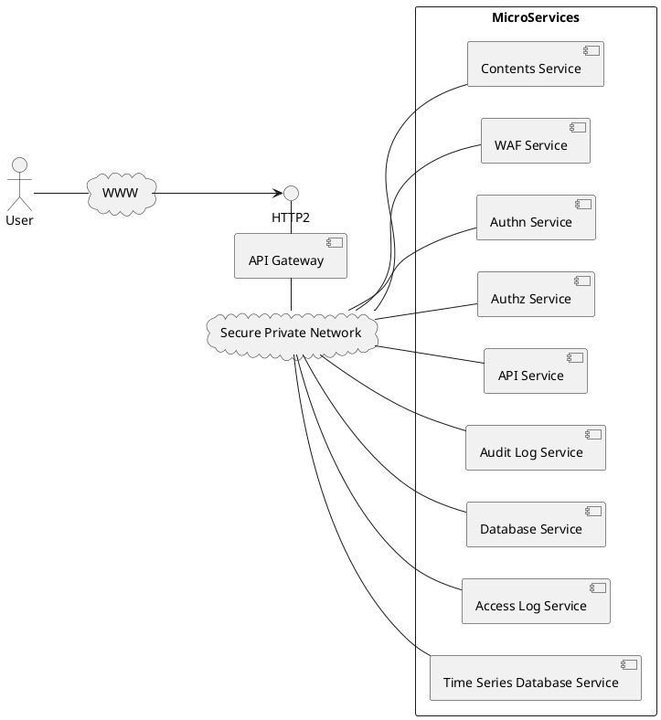

# API　Gateway

API Gateway は Web アプリケーションをマイクロサービスに分割して実装するための基本的な機能を提供します。
たとえば、WebコンテンツやAPIを提供する Web サイトを構築する際に、以下のように WAFサービス、認証サービス、認可サービス、コンテンツサービス、APIサービス、データベースサービス、アクセスログサービス、監査ログサービス、時系列データベースサービスというようにマイクロサービスに分割して提供できます。API Gateway とマイクロサービスの間およびマイクロサービス間の通信は SPN を経由して行われます。
API Gateway はコアサービスのメインコンテナと動作します。

## ゾーン

API Gateway にはDNSゾーンを登録します。ゾーンにゾーン同期サービスが登録されている場合、ゾーンの内容を API Gateway と同期します。
また、ACME サービスが登録されている場合、 ACME DNS-01 プロトコルでサーバ証明書を取得します。
master ゾーンはシステムで予約されており、master レルムのサービスを提供するのに用いられます。
また、レルムのユーザがドメインを持たない場合、 master ゾーンの下のサブドメインを使用することができます。

## リクエストコンテキスト

API Gateway では、リクエストコンテキストを使用して、リクエストの状態や情報を管理します。リクエストコンテキストは、リクエストごとに生成され、ルーティングチェーンの各ルールで利用されます。各ルールではリクエストのヘッダや変数を参照してアクションを決定することができます。

## ルーティング機能

API Gateway では、リクエストのルーティングを行うためのルールを定義できます。ルールは、リクエストのパスやヘッダ、メソッドなどに基づいて、適切なマイクロサービスにリクエストを転送します。ルールはルーティングチェーンと呼ばれるリストで管理され、チェーン間を渡り歩くことで複雑なルーティングを実現します。

## 冗長負荷分散機能

以下の冗長負荷分散をサポートします。（詳細未設計）

- Stateless Distributable
- Sticky Session Distributable
- Warm Standby(Activeプロセスのダウンを検知後すぐに切り替え)
- Cold Standby(Activeプロセスのダウンを検知後タスク起動)

## ロボット拒否

ビルトインチェーンでは検索エンジンのロボットを拒否する機能を提供する。

## BFF と M2M

API Gateway ではブラウザからのアクセスと外部システムからのAPI呼び出しを分けて処理します。前者に対応する機能を [BFF](./bff)、後者を [M2M](./m2m) と呼び、それぞれの章で説明します。

