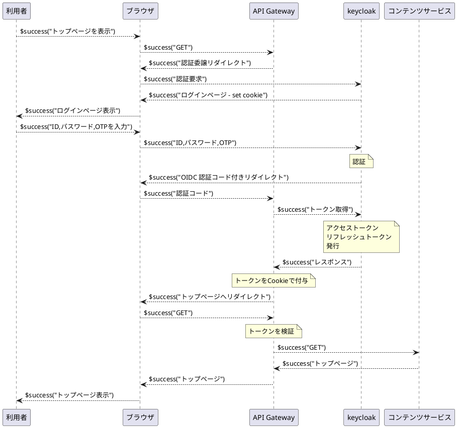

# BFF

BFF(Backend for Frontend)機能はフロントエンドからの API アクセスに対するリバースプロキシ機能を提供します。モダンアプリケーションの BFF に求められる諸所の機能を実現して API の実装内容を軽減します。

## ルートの分類

BFFではアクセスのルート(Route)を以下の4つに分類して処理します。

|分類|説明|未認証アクセス時の挙動|
|--|--|--|
|Landing Routes|未認証のユーザが最初にアクセスするパス|200 Ok|
|App Shell Routes|シェルページのHTMLを返すパスパターン|302 IdPへのリダイレクト|
|Asset Routes|JavaScript, CSS 画像などのコンテンツ|200 Ok|
|Protected Routes|認証済みのユーザのみがアクセスできるパス|401 アクセス拒否|

### セッション期限切れ問題

前述のように分類した上でアプリケーションの実装者は、JavaScript から Protected Routes にアクセスする場合にセッション切れによって401 Unauthorizedレスポンスを受け取った場合を考慮する必要があります。
API呼び出しはもちろんのこと、アプリケーションコードで直接制御していないライブラリが Protected Routes にアクセスする場合も対応が必要です。

MapLibreのようなライブラリは、地図の表示や操作に応じて、バックグラウンドで継続的に地図タイルやスタイル定義ファイルなどのリソースをサーバーに要求します。これらのリソースが Protected Routes にある場合、セッションが切れると問題が発生します。

以下にその発生例のシーケンスを示します。

1.  ユーザーが画面を放置し、BFFの認証セッションがタイムアウトします。
2.  ユーザーが地図をズームしたり、移動させたりします。
3.  MapLibreライブラリは、表示されていないエリアの新しい地図タイル（例: `/api/tiles/{z}/{x}/{y}.pbf`）を取得しようと`fetch`リクエストを送信します。
4.  サーバーはリクエストに有効なセッションがないため、`401 Unauthorized`を返します。
5.  MapLibreは地図タイル（バイナリデータ）を期待していましたが、代わりに`401`のステータスコード（場合によってはログインページのHTML）を受け取ります。
6.  ライブラリはこれをエラーとして処理し、**該当するタイルは描画されません**。結果として、地図の一部が灰色や空白のままになり、ユーザーから見ると **「地図が壊れた・崩れた」** 状態になります。

### セッション期限切れ対策

この問題に対処するには、ライブラリ自身にエラー処理をさせるのではなく、アプリケーション全体でネットワークリクエストを制御する層を設けるのが最も堅牢なアプローチです。

グローバルなfetchのインターセプトが最も汎用的で強力な方法です。アプリケーション内の**すべての`fetch`リクエストを一元的に監視**し、`401`エラーが発生した場合に App Shell Routes でのリロードを強制的に実行させます。

**仕組み:**
1.  アプリケーションの起動時に、ブラウザ標準の`fetch`関数をラップ（上書き）する独自の関数を定義します。
2.  このラッパー関数は、実際のリクエストを実行した後、レスポンスのステータスコードをチェックします。
3.  もしステータスが`401`であった場合、**元の呼び出し元（MapLibreなど）にレスポンスを返さず**、その場で App Shell Routes でのリロードを実行します。

**メリット:**
* **一元管理**: この仕組みを一つ導入するだけで、MapLibreだけでなく、将来導入するかもしれない他のどんなライブラリからのリクエストも保護できます。
* **関心の分離**: ライブラリはリソースの取得に専念でき、アプリケーションは認証状態の管理に専念できます。

`axios`のようなHTTPクライアントライブラリには「インターセプター」としてこの機能が組み込まれています。標準の`fetch`で実現する場合は、自身でラッパーを実装します。

## レンダリング手法

BFFの最適な挙動について考察するためにモダンなアプリケーションのレンダリング手法を分類します。Next.js などのモダンなアプリケーション向けのミドルウェアでは、以下のようにレンダリング手法をページ単位で使い分けることができます。

| | SSR (Server-Side Rendering) | SSG (Static Site Generation) | CSR (Client-Side Rendering) |
| :--- | :--- | :--- | :--- |
| **最適なケース** | ユーザー毎に内容が変わる動的なページ | ブログ記事、マーケティングサイト、ドキュメント | ログイン後の管理画面ダッシュボード |
| **SEO** | **◎ 最適** | **◎ 最適** | △ （対応が別途必要） |
| **初回表示速度**| **◎ 高速** | **◎ 最速** | × （遅い） |
| **データの鮮度** | **常に最新** | ビルド時のデータ | 常に最新（クライアントで取得） |
| **Next.jsの関数**| `getServerSideProps` | `getStaticProps` | `useEffect` などでデータ取得 |

モダンなアプリケーションでは React などを使用して CSR を使用するのが一般的ですが、「SEOを最重要視する」場合と「初回表示を高速化したい」場合は SSG/SSR を使用することになります。

しかし、この BFF では以下の理由で SSR の利用は推奨しません。

- SSRでアクセスしているユーザの属性を取得するためには SSR のシェルページを Protected Routes に置く必要があるが、セッション切れとなった場合に BFF が 401 のHTMLを返すため、スマートな画面遷移を提供できない

また、CSRを実装する際は、前述のセッション期限切れ対策を実装する必要があります。

## BFFの機能

Web プロキシのコンフィグレーションでロケーション(FQDN+パスのパターンで特定)を指定してBFFを追加できます。
BFFは以下の機能を提供します。
- Open ID Connect プロトコルで IdP を呼び出し、IDトークンとアクセストークンを取得
- IDトークンとアクセストークンをセッション情報として構成情報データベースに保存
- デバイスIDをセキュアなCookie（HttpOnly, Secure, SameSite=Strict）を発行
- デフォルトで Robot.txt を返して検索ロボットの巡回を拒否
- 静的コンテンツを起動時にロードして配信
- キャッシュバスター付きのパスを持つ静的コンテンツのバージョンアップ対応
- 単純なリクエストを拒否（400を返す）
- 必要に応じて HTTPレスポンスに CORS 関係のヘッダを追加
- 必要に応じて HTTPレスポンスに CSPヘッダを追加
- 必要に応じて HTTPレスポンスに X-Frame-Options ヘッダを追加
- 必要に応じてセッション情報の内容を取得するAPIを提供
- App Shell Routes に対するGETリクエストに対して IdP へのリダイレクトを返す
- 必要に応じてセッション情報の一覧取得（自分の接続中のセッションの確認）・削除（管理者による強制ログアウト）を別のBFFを経由して行える API を提供

:::info
CSRF防御について CSRFトークンを発行するという機能を追加することも可能であるが、セキュアなCookieの発行と単純なリクエストの拒否で十分であると考えています。
:::

:::note
バックエンドのコードがリバースプロキシを前提としないアプリの場合、以下のような機能が必要になる可能性があるが、 API Gateway はこれを実装しない
- バックエンドが返す Location ヘッダ値の書き換え
- バックエンドが返す HTML/JavaScript 内の文字列の書き換え（gzip による圧縮や Transfer-Encoding: chunked に対応する必要あり）
:::

### デバイスコンテキスト

CHIPIN_DEVICE_CONTEXT Cookie でアクセス元デバイスを識別しますが、攻撃などで負荷がかからないようにサーバ側での管理は行わず JWT の発行にとどめます。デバイスコンテキストのデバイスIDをログに記録することによって、以下のような場合でもアクセスを串刺しにできます。

- ブラウザを開いたままログアウトして別のユーザでログインしなおした場合
- SP にアクセスして認証サーバにリダイレクトされた場合

また、ドメイン内でデバイスコンテキストを共有できます。

#### COOKIEの属性

CHIPIN_DEVICE_CONTEXT Cookie は HttpOnly, Secure, SameSite=Strict 属性を持ち、セキュアな Cookie として扱われます。また、Expires 属性を設定して、セッションの有効期限を指定します。

#### JWTの内容
CHIPIN_DEVICE_CONTEXT Cookie には JWT が含まれ、以下の情報が含まれます。
- 発行者(iss)
- デバイスID(sub)
- 初回発行日時(iat)
- 有効期限(exp)
JWTの署名には、API Gateway の秘密鍵が使用されます。これにより、デバイスIDの改ざんを防ぎます。

#### デバイスIDの管理

ユーザが BFF にアクセスすると、CHIPIN_DEVICE_CONTEXT Cookie が存在しない場合、BFFは新しいデバイスIDをを発行します。
デバイスIDはPRNG（擬似乱数生成器）を使用して生成された9バイトの数値で、base64で 12文字の文字列にエンコードされます。

CHIPIN_DEVICE_CONTEXT Cookie が存在する場合は、JWTを検証し、 iss, exp の妥当性をチェックします。
sub の値をデバイスIDとして使用します。有効期限が再発行閾値を過ぎている場合は、CHIPIN_DEVICE_CONTEXT Cookie を再発行します。
このとき、exp 以外の値は引き継がれます。
デバイスIDはメモリ上に保存して管理しているわけではないので、サーバ側で無効化することはできません。セッションの有効期限が切れるまで有効です。

新しくデバイスIDを生成した場合、および再発行した場合はレスポンスヘッダに Set-Cookie: CHIPIN_DEVICE_CONTEXT=**JWT**;HttpOnly;Secure;SameSite=Strict; を追加します。
サブドメインに shareCookie: true が設定されている場合は、CHIPIN_DEVICE_CONTEXT Cookie の Domain 属性にサブドメインの FQDN を設定します。これにより、同じサブドメイン配下の仮想ホスト間でセッションを共有できます。

#### COOKIEの利用

リクエストオブジェクトの変数にデバイスコンテキストの内容が設定されます。
この変数を参照してログに出力したり、バックエンドのロジックに渡したりすることができます。

### 認証済みセッション

API Gateway から OIDC の認証サービスを呼び出すことによって認証を行うことができます。
以下に OIDC の認証サービスと連携する場合のシーケンスを示します。

上記の動作は API Gateway から呼び出された認証サービスによって行われます。認証に成功すると、デバイスコンテキストで発行されたデバイスIDをキーにしてセッションオブジェクトをメモリ上に作成し、そこにユーザIDなど認証で得られたユーザの属性情報を保持します。
認証済みセッションの管理は認証サービスにより行われます。認証サービスは前述のデバイスIDをキーにしてデータベース上にセッション情報を保存します。セッション情報にはユーザIDや所属など RBAC, ABAC で利用するための属性情報が含まれます。

#### ログイン記録

認証に成功すると、ログイン記録データベースにログインの記録を書き込みます。ログインの記録には以下のものが含まれます。

- ユーザID
- ログイン日時
- ログアウト日時
- ログアウト理由
- ロケーション
- デバイスID

ユーザのアクセス元グローバルIPをキーとしてロケーションを特定します。[GeoLite2 City](https://dev.maxmind.com/geoip/geolite2-free-geolocation-data/) により、その地理情報を特定します。特定した地理情報のネットワークアドレス（CIDR）をロケーションとします。また、[GeoLite2 ASN](https://dev.maxmind.com/geoip/docs/databases/asn/) によりグローバルIPの管理組織も特定します。それらの情報をロケーションをキーとしてロケーションテーブルに登録します。

また、同じ内容をサーバのログとしても出力します。このときはログイン記録データベースに問い合わせて以下の情報を追加します。

- そのユーザがそのデバイスからログインするのが初めてかどうか
- そのユーザがそのロケーションからログインするのが初めてかどうか

このログを監視することで、ユーザが新しい環境やネットワークからログインした場合にアラートを上げるなどの機能を実装できます。

## エラーレスポンス調整機能

API Gateway がブラウザにエラーを返す場合、そのボディ部の内容については以下のような課題がある。
- トップページのアクセスにおいて API Gateway の内部で発生する 400番台、500番台のエラーについてアプリケーションの Web UI のデザインにあわせた HTML を表示したい
- トップページ以外のアクセスにおいて HTML を返してもエンドユーザに表示されるわけではないので無意味である
- API のアクセスにおいて、 API Gateway の内部で 400番台、500番台のエラが発生した場合、 Accept ヘッダーにない Content-Type などAPIの呼び出し側が想定していないものを返すのはアプリケーションのエラー処理を複雑にする（間のリバースプロキシが入っている場合のエラー処理を追加しなければならない）
これらの問題に対応するために

## コンテントセキュリティポリシー管理

CSPヘッダーを付与する

### CSP違反記録サービス

（詳細未執筆）

### iframe 管理

X-Frame-Options ヘッダーを付与する。（詳細未執筆）

## アプリケーションログ記録サービス

SPAでは、ユーザの操作ごとにサーバへのアクセスがあるわけではないので、アクセスログではユーザがどのような操作をしたかを特定することはできません。
また、クライアント側でエラーやワーニングが出た場合もサーバではその内容を知ることはできません。そこで、ユーザの操作ログやエラーログを受け付けてサーバ側で記録する機能を提供します。

[pino HTTP送信モジュール](https://github.com/procube-open/pino-transmit-http)を推奨。

### WAFサービス

[ModSerurity](https://modsecurity.org/)にSPNエージェントをサイドカーとして付与して提供します。
