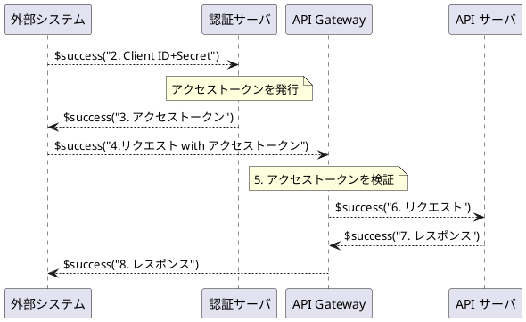

# M2M通信

外部システムが HTTP の API でアクセスしてくる場合のセッション管理においては Cookie の保存を前提とすることができません。このようなマシン対マシン（M2M）通信では、 OAuth 2.0 クライアントクレデンシャルズグラント (Client Credentials Grant) という認証フローを使用します。これは、ユーザーの介在なしに、アプリケーション自体が認証を行い、APIアクセスのためのトークンを取得するための仕組みです。
これを使用することにより、秘密情報の漏洩を防ぎつつ、アクセスを追跡しやすくできます。

:::note
M2M 通信と BFF とはパスなどによって排他的に適用されます。
:::

以下にクライアントクレデンシャルズグラントの認証フローのステップを示します。

## 1. 事前登録
APIを利用したい外部システム（クライアント）は、事前にあなたの認証サーバー（IdP）に登録されます。登録後、そのシステム専用の Client ID と Client Secret が発行されます。これらはシステムのIDとパスワードのようなものです。
また、認証サーバがJWTの署名に使用する鍵を API Gateway に登録します。API Gateway はこの鍵を使用してアクセストークンの署名を検証します。

## 2. トークンの要求
外部システムは、自身の Client ID と Client Secret を使って、認証サーバーのトークンエンドポイントに直接APIリクエストを送信し、アクセストークンを要求します。

## 3. トークンの取得
認証サーバーは送られてきた Client ID と Client Secret を検証し、正当であれば、そのシステム（クライアント）の権限を表すアクセストークンを発行します。このトークンは特定のユーザーに紐づくものではなく、システム自体に紐づきます。

## 4. APIの呼び出し
外部システムは、取得したアクセストークンを Authorization: Bearer アクセストークン ヘッダーに含めて、保護されたAPIを直接呼び出します。

## 5. API Gateway での検証
API Gateway は、リクエストで受け取ったアクセストークンを検証し、有効であればリクエストを処理します。

#### 6. リクエストの転送

API Gateway は、リクエストをバックエンドの API サーバに送ります。

#### 7. レスポンスの受信
API サーバはリクエストに対するレスポンスを API Gateway に返します。

#### 8. レスポンスの返却
API Gateway は、受け取ったレスポンスを外部システムに返します。

