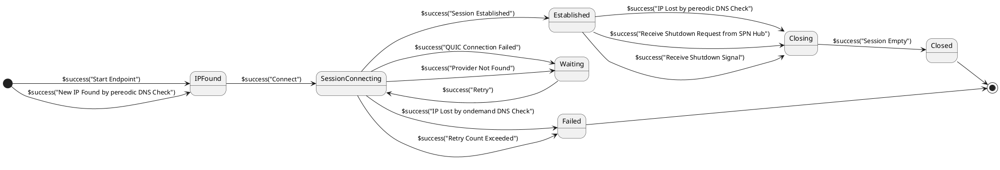
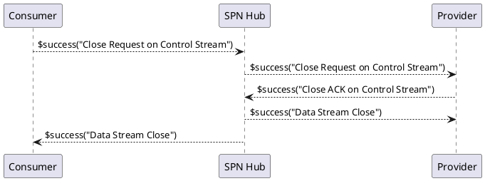
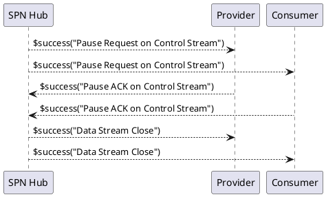
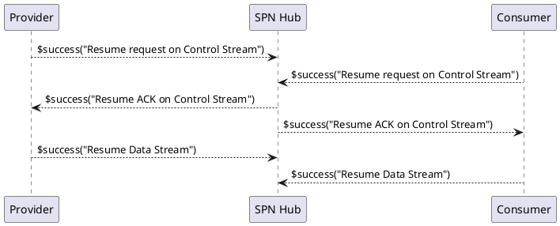
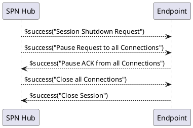
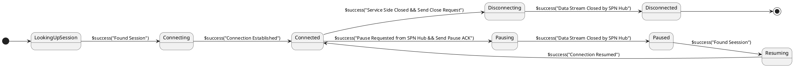
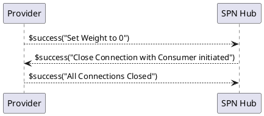

import ApiSchema from '@theme/ApiSchema';

# SPN Hub

SPN Hub では SPN エンドポイントからの QUIC での接続を受け付けて、仮想的で閉じたネットワークを提供します。

## SPN エンドポイント

SPN エンドポイントは QUIC で SPN Hub に接続するクライアントです。SPNエンドポイントは SPN create を使用して rust で開発することが可能です。
また、SPN エージェントを利用して、TCPのクライアント/サーバにも接続できます。

## SPN セッション

SPN セッションは QUIC のコネクションと同義ですが、SPNのコネクションとの混同を避けるためにあえて、SPN セッションと呼びます。
この他に Chip-in では HTTP のセッションやコネクションも登場しますが、それらとも区別してください。

QUIC コネクション確立後、最初に SPN エンドポイントから SPN Hub に向かって制御ストリームを開始します。制御ストリームの最初の通信として SPN エンドポイントはSPN hub に SPN セッション確立要求を送信します。
SPN Hub は、セッション確立要求が SPN 内のサービス定義に照らし合わせて許容されていれば SPN エンドポイントにACKを返すとともに SPN セッションオブジェクトをメモリ上に作成します。
セッション確立後も制御ストリームは接続した状態となり、さまざまな制御パケットの通信に使用されます。

SPN セッションオブジェクトには以下が保持されます。

|項目名|説明|
|--|--|
|startAt|セッション開始時刻|
|spnSessionId|セッションID（QUIC のサーバ側コネクションIDを使用する）|
|spnEndPoint|QUICコネクションの確立に使用されたクライアント証明書の Subject の値|
|endPointType|"serviceProvider", "serviceConsumer" のいずれか|
|serviceUrn|セッションのサービスのエンドポイントのURN|
|totalConnectionCount|このセッション上で作成された SPNコネクションの総数|

SPN　セッションはセッションの開設時と終了時にログを出力します。ログの項目は以下の通り。

|項目名|説明|
|--|--|
|timestamp|イベント発生時刻（ログの出力時刻と異なる場合があるのでイベント発生時の時刻を記録する）|
|spnSessionId|セッションID（QUIC のサーバ側コネクションIDを使用する）|
|spnEndPoint|QUICコネクションの確立に使用されたクライアント証明書の Subject の値|
|eventType|"startSpnSession", "endSpnSession" のいずれか|
|endPointType|"serviceProvider", "serviceConsumer" のいずれか|
|serviceUrn|セッションのサービスのURN|
|totalConnectionCount|このセッション上で作成された SPNコネクションの総数。endSpnSession のときのみ出力される|
|elapsedTime|セッション開設時からの経過時間。endSpnSession のときのみ出力される|
|terminateReason|セッションの終了理由。"shutdown", "terminatedByPeer", "error" のいずれか。endSpnSession のときのみ出力される|

### エンドポイント側セッション管理

エンドポイント側のSPN セッションは以下のように状態遷移します。

#### SNP Hub のマルチインスタンス

SPN Hub は複数稼働させることができます。ただし、それぞれの SPN Hub は異なるグローバルIPを持ちます。
DNS上では SPN Hub の1個のFQDNに対して起動中のグローバルIPアドレスをすべて返すようにします。
エンドポイント側では、起動時に SPN Hub の FQDN を解決し、得られたグローバルIPアドレスの全てに対してセッションを確立します。
また、定期的に SPN Hub の FQDN を解決し、得られたグローバルIPアドレスの変化を監視します。グローバルIPが削除された場合は、内包するコネクションを中断してセッションを終了し別の SPN Hub に接続し直してコネクションを再開します。

エンドポイント側で複数の SPN セッションがある状態で新しいコネクションが必要となった場合はどれか一つのセッションを選択してコネクションを確立します。

## SPN コネクション

SPN コネクションは QUIC のコネクションと異なり、serviceConsumer エンドポイントから SPN Hub を経由して serviceProvider エンドポイントに接続するストリームです。
SPN コネクションは以下の構成要素からなります。
- serviceConsumer エンドポイントと SPN Hub の間の双方向 QUIC ストリーム
- SPN Hub と serviceProvider エンドポイントの間の双方向 QUIC ストリーム
- SPN コネクション管理オブジェクト

SPNコネクションの確立は
1. serviceConsumer エンドポイントは SPN Hub との間の双方向 QUIC ストリーム上に最初のパケットを送る
2. SPN Hub は serviceProvider エンドポイントとの間の双方向 QUIC ストリーム上にそのパケットを転送する
SPN コネクションオブジェクトには以下が保持されます。

|項目名|説明|
|--|--|
|startAt|コネクション開始時刻|
|spnConnectionId|SPNコネクションID（QUIC のストリームIDを serviceConsumer側、serviceProvider側の順に連結したものを使用する）|
|consumerSideSpnSessionId|serviceConsumer側 SPN セッションのID|
|providerSideSpnSessionId|serviceProvider側 SPN セッションのID|
|totalSentBytes|このストリーム上で serviceConsumerからserviceProviderに送信したデータの累計バイト数|
|totalReceiveBytes|このストリーム上で serviceConsumer がserviceProviderから受信したデータの累計バイト数|

SPN　セッションはセッションの開設時と終了時にログを出力します。ログの項目は以下の通り。

|項目名|説明|
|--|--|
|timestamp|イベント発生時刻（ログの出力時刻と異なる場合があるのでイベント発生時の時刻を記録する）|
|spnConnectionId|SPNコネクションID（QUIC のストリームIDを serviceConsumer側、serviceProvider側の順に連結したものを使用する）|
|eventType|"startSpnConnection", "endSpnConnection" のいずれか|
|consumerSideSpnSessionId|serviceConsumer側 SPN セッションのID|
|providerSideSpnSessionId|serviceProvider側 SPN セッションのID|
|totalSentBytes|このストリーム上で serviceConsumerからserviceProviderに送信したデータの累計バイト数。 endSpnConnection のときのみ出力される|
|totalReceiveBytes|このストリーム上で serviceConsumer がserviceProviderから受信したデータの累計バイト数。 endSpnConnection のときのみ出力される|
|elapsedTime|コネクション開設時からの経過時間。 endSpnConnection のときのみ出力される|
|disconnectReason|コネクションの切断理由。"closedByPeer", "closed", "error" のいずれか。 endSpnConnection のときのみ出力される|

### コネクションの終了

コネクションは SPN エンドポイント側からの終了要求により終了します。

上記は Consumer 側からのコネクション終了要求のフローですが、Provider 側からの終了要求も同様に行われます。

### コネクションの中断と再開

コネクションは SPN Hub 側からの中断要求により中断されます。これは、 SPN Hub がサービスのメンテナンスや再起動を行う場合に発生します。

コネクションはエンドポイント側からの再開要求により再開されます。

SPN Hub の再開可能なシャットダウンにおけるエンドポイントととのフローは以下の通りです。

SPN Hub が複数インスタンスの状態で1個の SPN Hub を停止する場合は全てのエンドポイントに再開可能なシャットダウンを通知します。
エンドポイントはコネクションを中断しますが、すぐに別の SPN Hub に接続し直すことができます。
SPN Hub のローリングアップデートやサーバ再起動のためのマイグレーションの場合は、一旦新しいSPN Hub を起動してから、古い SPN Hub に再開可能なシャットダウンをかけることでエンドポイント間の通信は継続されます。

SPN Hub の計画停止については、エンドポイントを Consumer -> Provider の順にシャットダウンし、その後、 SPN Hub を停止します。
それ以外の全てのケースではエンドポイント側でエラーが発生します。

### エンドポイント状態遷移

エンドポイントのコネクションの状態遷移は以下の通り。

### Provider のマルチインスタンスについて

Providerから複数のセッション接続がある場合、デフォルトでは冗長負荷分散で動作します。
インベントリのサービス定義にそのサービスがシングルトンであるかどうかを示すフラグ `singleton` があり、これがtrue の場合、サービスはシングルトンであり、SPN Hub は2個目のサービスの接続を受け付けず、単一のインスタンスでの動作のみとなります。

false の場合、SPN Hub は複数のセッションを受け付け、コネクションごとに付加分散して接続します。
Consumer から接続があった際に最も接続数の少ないサービスに接続します。
Provider は分散重み付を変更することができます。重み付値のデフォルトは 100 であり、SPN Hub は接続されているすべての Provider インスタンスの重み付を合計して、インスタンスごとの按分値を算出します。コネクション接続時に按分値と現在の接続数を比較して、接続数の少ないインスタンスに接続します。
ローリングアップデート時は重み付を0に変更してからグレースフルシャットダウンを行うことで、無停止でのアップデートが可能となります。

Provider の重み付が 0　に設定された後、Consumer からの新しい接続別の Provider インスタンスに接続されます。

Consumer と Provider 間のコネクションのグレースフルシャットダウンについてはアプリケーション層で実装する必要があります。例えば、 HTTP の場合は Provider 側から Keep-Alive ヘッダを使用して、コネクションの終了を通知することができます。また、Consumer 側では Keep Alive のタイムアウトで接続をやり直すので、コネクションは破棄されます。

すべてのコネクションが新しい Provider インスタンスに接続されると、古い Provider インスタンスとのセッションは切断され、インスタンスは終了します。

## spnhub コマンド

spnhub コマンドは SPN Hub を実装します。spnhub コマンドのパラメータはコマンドラインオプションと環境変数のいずれかで指定できます。
パラメータには以下のものがあります。

|オプション|環境変数名|説明|デフォルト|
|--|--|--|--|
|-c |SPNHUB_INVENTORY_URL|SPN Hub の構成情報を提供するインベントリのURL。|http://localhost:8080|

spnhubコマンドは起動時とリロードシグナル受信時に構成情報を[インベントリ](/docs/devSpecification/inventory-openapi) から読み込みます。具体的には以下の順に読み込みます。リロードシグナルは SIGUSR1 です。

### 1. レルムの読み込み

全てのレルムを読み込みます。
SPN Hub はレルムごとに内部が分離されており、マルチテナントのシステムを容易に実装できます。

<ApiSchema pointer="#/components/schemas/Realm" />

- disabled が True のものは無視します。
- リロードにおいては、一覧の前後を比較し、追加削除を行います。

### 2. SPN Hub の構築

レルムごとに SPN Hub を構築します。

<ApiSchema pointer="#/components/schemas/Hub" />

### 3. サービスの構築

SPN Hub ごとにサービスの定義を読み込みます。

<ApiSchema pointer="#/components/schemas/Service" />

availabilityManagement が指定されていて、かつ ondemandStart が false のサービスについてはクラスタマネージャを呼び出してサービスを起動する。
サービス定義の読み込みが終わった時点で、SPN Hub での QUIC パケットの受信を開始します。

