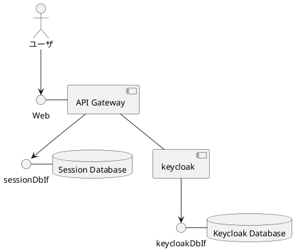
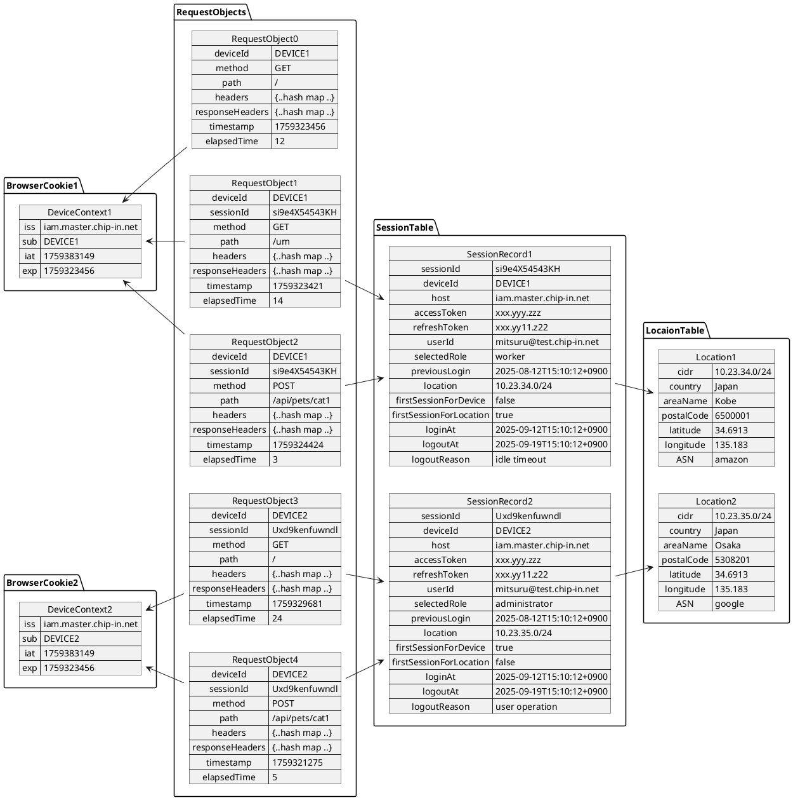
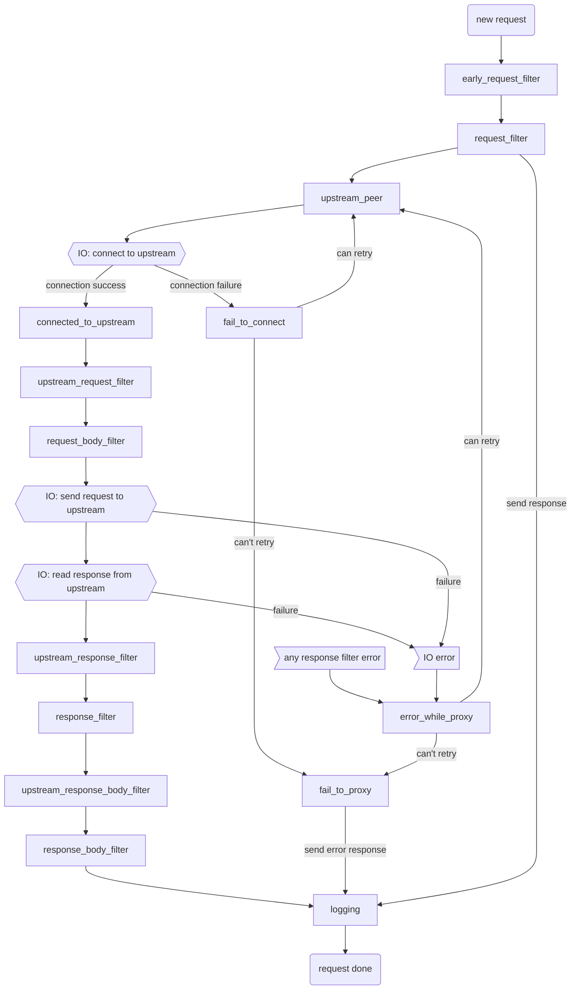

import Redoc from '@theme/Redoc';

# ルーティング処理

API Gateway は、リクエストを適切なサービスにルーティングするための機能を提供します。以下のセクションでは、ルーティングの基本的な概念と実装方法について説明します。

## SNIによる仮想ホストの特定

API Gateway は最初に SNI で宛先のFQDNを判定します。FQDNをキーとして仮想ホストを特定します。
仮想ホストが登録されていない場合は接続を拒否します。
仮想ホストが登録されている場合は、仮想ホストに設定されているルーティングチェーンを使用してリクエストを処理します。

## リクエストライフサイクル

以下に HTTP リクエストのライフサイクルを示します。

1. HTTP　リクエストのライフサイクルは、API Gatewayがクライアント(downstream)からリクエストヘッダを読み取ったときに始まります。
2. API Gateway はバックエンド（upstream）に接続します。再利用できる接続が既に確立されている場合、このステップはスキップされます。
3. API Gateway はリクエストヘッダをバックエンドに送信します。
4. リクエストヘッダが送信されると、API Gateway は二重モードに入り、同時に次の処理を実行します。
    - リクエストのボディ(存在する場合) をバックエンドに転送します
    - バックエンドからのレスポンス (ヘッダとボディの両方) をクライアントに転送します
5. リクエスト/レスポンス全体が終了すると、リクエストのライフサイクルは終了し、すべてのリソースが解放されます。クライアントとの接続とバックエンドとの接続は、条件を満たせば再利用のために維持されます。

## リクエストオブジェクト

ルーティングにおいてはリクエストごとにオブジェクトが作成されます。オブジェクトにはデバイスID、HTTPリクエストの属性、レスポンスヘッダなどが格納されます。
これは以下の機能で利用されます。

- デバイスID管理アクションでデバイスIDと関連付け
- ルーティングチェーンの match 式で参照
- setHeader, addCookie アクションで参照
- setHeader, addCookie アクションでオブジェクトの値を変更
- ログ出力アクションの値式で参照
- 認証アクションでセッションと関連付け


## BFF における認証処理

BFFにおいては、 Keycloak と Open ID Connect プロトコルで連携して認証を実装します。API Gateway と Cloak の認証の関係を以下に示します。



### セッションレコード

セッションデータベースのセッションテーブルにはセッションレコードが記録される。




## API Gateway のフェーズとフィルタ

API Gateway ではルーティングチェーンを記述することでリクエストのライフサイクルに任意のロジックを挿入できます。
以下に、API Gateway の実装ベースである Pingora のフェーズとフィルターのフローを示します。



以下に API Gateway における各フィルタの処理内容を説明します。記載のないフィルタについては Pingora のデフォルトの処理が呼び出されます。

### early_request_filter


### request_filter()

このフィルターでルーティングチェーンを処理します。デフォルトでの処理内容は以下の通り。

- SNI で識別したホスト名と Host ヘッダの値が異なる（小文字で正規化後称号）場合は 400 Bad Request を返す

### upstream_request_filter()
ルーティングチェーンで set_request_header アクションがあればその内容に従ってバックエンドに送るヘッダの値を変更します。

### upstream_response_filter()
ルーティングチェーンで set_response_header アクションがあればその内容に従ってレスポンスヘッダの値を変更します。
このフェーズでは、下流に送信する前に、レスポンスのヘッダーを変更します。このフェーズはHTTPキャッシュの前に呼び出されるため、ここで行われた変更はHTTPキャッシュに保存されているレスポンスに影響することに注意してください。

## ルーティングチェーンの処理

ルーティングチェーンはルールのリストであり、順にルールの match 条件を評価し、条件を満たしたルールのアクションを実行します。各アクションについて[次の章](routing-action)で説明します。

## サービス待ちSSE

API Gateway ではサービスが利用可能になるのを待つための SSE (Server-Sent Events) を提供します。

<Redoc id="waitfor-services" />

##

### デバイスコンテキスト

デバイスコンテキストは "device_" で始まる変数に保持されます。 

| 変数名                  | 型       | 説明                                |
|:-----------------------|:---------|:---------------------------------|
| device_context_originator | string   | デバイスIDを発行した仮想ホストのFQDN |
| device_id              | string   | デバイスID.                      | 
| device_start_at        | integer  | 発行日時（UNIXタイムスタンプ）     | 
| device_expire_at       | integer  | 有効期限（UNIXタイムスタンプ）     |

### HTTPリクエスト

HTTP リクエストは "request_" で始まる変数に保持されます。

| 変数名                  | 型       | 説明                                |　例 |
|:-----------------------|:---------|:---------------------------------|:------------|
| request_path           | string   | HTTPリクエストのパス | /my/path |
| request_method         | string   | HTTPリクエストのメソッド | GET |
| request_param_XXXX     | string   | HTTPリクエストのクエリパラメータ | 下の例を参照 |
| request_header_XXXX     | string   | HTTPリクエストのヘッダ | 下の例を参照 |

例については、以下のリクエストを受信した場合の値を示しています。

```
curl 'https://api.master.chip-in.net/my/path?parameter1=value1&parameter2=value1&parameter2=value2&parameter3=value1,value2' -H 'header1: value1' -H 'header2: value1' -H 'header2: value2' -H 'Accept: text/html, application/xhtml+xml'
```

### クエリパラメータ


:::note
ヘッダとクエリパラメータの複数値の値について検討中
:::

